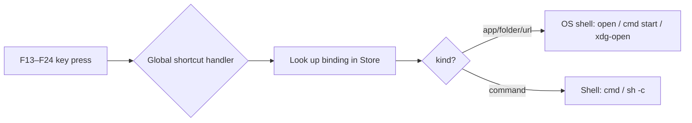

#  Small Deck

**Turn F13–F24 into software launchers — the Stream Deck "Open" action, self-contained.**

Small Deck is a lightweight, cross-platform desktop tray app that binds the
F13–F24 function keys (configured on your [XPAD](https://xtiaconfiger.com)) to
programs, folders, URLs, or shell commands.  No AutoHotkey.  No Keyboard
Maestro.  Just install, bind, and press.

<p align="center">
  
  
  
</p>

---

## Table of Contents

- [How It Works](#how-it-works)
- [Prerequisites](#prerequisites)
- [Installation](#installation)
- [Usage](#usage)
- [Configuration](#configuration)
- [Tech Stack](#tech-stack)
- [Project Structure](#project-structure)
- [Development](#development)
- [Contributing](#contributing)
- [License](#license)

---

## How It Works

1. **XPAD sends F13–F24.**  These keys do nothing on any OS by default — clean,
   conflict-free triggers.
2. **Small Deck registers them as global hotkeys.**  When a key is pressed, the
   app looks up your binding and launches the target — regardless of which
   window is focused.
3. **The device doesn't need to stay connected.**  Hotkeys work entirely in
   software once registered.  USB is only used during initial setup to read
   which keys you assigned on the XPAD configurator's *Small Deck* tab.



---

## Prerequisites

| Dependency | Version | Notes |
|-----------|---------|-------|
| **Rust** (stable) | ≥1.70 | [rustup.rs](https://rustup.rs) |
| **Node.js** | ≥18 | [nodejs.org](https://nodejs.org) |
| **Platform toolchain** | — | See [Tauri prerequisites](https://tauri.app/start/prerequisites/) |

**Platform-specific extras:**

| OS | Required |
|----|----------|
| **Windows** | WebView2 (preinstalled on Win 11), [MSVC Build Tools](https://visualstudio.microsoft.com/visual-cpp-build-tools/) |
| **macOS** | Xcode Command Line Tools (`xcode-select --install`) |
| **Linux** | `libwebkit2gtk-4.1-dev`, `libusb-1.0-0-dev`, `libayatana-appindicator3-dev` |

---

## Installation

### Download pre-built installer

Check the [Releases](https://github.com/StevenLeeCS/small-deck/releases) page
for the latest `Small-Deck-Windows.exe`, `Small-Deck-macOS.dmg`, or
`Small-Deck-Linux.AppImage`.

### Build from source

```bash
# 1. Clone
git clone https://github.com/StevenLeeCS/small-deck.git
cd small-deck

# 2. Install dependencies
npm install

# 3. Generate app icons (first time only)
npm run tauri icon src-tauri/icons/icon-source.png

# 4. Build
npm run build
```

Installers are written to `src-tauri/target/release/bundle/`.

> **Linux users:** you may need a udev rule for USB access — see
> [USB Access](#usb-access).

---

## Usage

### Quick start

```bash
npm run dev          # development mode with hot-reload
```

Or double-click the installed **Small Deck** shortcut.

### Binding a key

1. Open Small Deck.  If an XPAD is connected, click **Read XPAD** to see only
   your configured keys.  Otherwise, check **Show all F13–F24**.
2. Click any F‑key row (e.g. **F13**).
3. Choose a binding type from the docked inspector:

   | Type | Example | How |
   |------|---------|-----|
   | **Program** | `notepad.exe` | Browse or type a path |
   | **Folder** | `~/Projects` | Directory picker |
   | **URL** | `github.com` | Type a URL (auto-prepends `https://`) |
   | **Command** | `echo hello && pause` | Multi-line; **Ctrl+Enter** to save |

4. Click **Save**, then **Test** to verify.

### Tray behaviour

- **Close** the window → hides to the system tray (hotkeys stay active).
- **Right-click** the tray icon → Show / Quit.
- **Left-click** the tray icon → bring window back.
- First close-to-tray shows a one-time notification so you know it's still running.

### Dark mode

Small Deck automatically follows your OS light / dark preference.  Toggle your
system theme to see it switch in real time — no restart needed.

### macOS caveat

F21–F24 have no global-hotkey scancode on macOS, so those four keys are greyed
out there.  F13–F20 work on all platforms.

---

## Configuration

### Bindings file

Mappings are stored as human-readable JSON at:

| OS | Path |
|----|------|
| Windows | `%APPDATA%\com.xtia.xpad.smalldeck\mappings.json` |
| macOS | `~/Library/Application Support/com.xtia.xpad.smalldeck/mappings.json` |
| Linux | `~/.config/com.xtia.xpad.smalldeck/mappings.json` |

Example:

```json
{
  "F13": { "path": "C:\\Program Files\\MyApp\\app.exe", "name": "MyApp", "kind": "app" },
  "F14": { "path": "https://github.com",                "name": "GitHub", "kind": "url" },
  "F15": { "path": "echo Build started && npm run build","name": "Build", "kind": "command" }
}
```

### Autostart

Enable **Start on login** in Settings.  The app will launch silently to the tray
on boot (no window pop).

### USB access

| OS | Setup |
|----|-------|
| **Windows** | Works out of the box — firmware advertises WinUSB via MS OS 2.0 descriptors |
| **Linux** | Add a udev rule for VID `1209` / PID `0001`, or run with `sudo` (not recommended) |
| **macOS** | Works with `rusb` — no special setup |

---

## Tech Stack

| Layer | Technology |
|-------|-----------|
| **Desktop shell** | [Tauri v2](https://tauri.app) |
| **Backend** | Rust — `rusb`, `serde`, `serde_json` |
| **Frontend** | Vanilla JS + CSS + HTML — no framework, no bundler |
| **Hotkeys** | `tauri-plugin-global-shortcut` |
| **Persistence** | JSON file in per-user app config directory |
| **USB** | Read-only vendor‑interface commands (0x32, 0x33) |
| **i18n** | Lightweight ad‑hoc engine — English / 中文 |
| **Packaging** | NSIS (`.exe`), WiX (`.msi`), DMG, AppImage |

---

## Project Structure

```
small-deck/
├── src/                          # Frontend (served directly, no build step)
│   ├── index.html                 # Single-page UI
│   ├── app.js                     # Rendering, bindings, Tauri bridge
│   ├── i18n.js                    # Bilingual engine (window.t / window.setLang)
│   └── style.css                  # All styles; CSS-variable theming (light + dark)
├── src-tauri/
│   ├── src/
│   │   ├── main.rs                # Entry point
│   │   ├── lib.rs                 # App setup: tray, hotkeys, commands, plugins
│   │   ├── launcher.rs            # Cross-platform launcher
│   │   ├── xpad.rs                # USB device communication (read-only)
│   │   ├── store.rs               # JSON persistence
│   │   └── icons.rs               # macOS .icns → PNG extraction
│   ├── capabilities/default.json  # Tauri v2 permission grants
│   ├── tauri.conf.json            # Window config, CSP, bundle settings
│   ├── Cargo.toml                 # Rust dependencies + release profile
│   └── build.rs
├── .github/workflows/             # CI: 3‑platform build + GitHub Release
├── package.json                   # @tauri-apps/cli (dev only)
├── CLAUDE.md                      # Project documentation for AI assistants
└── README.md
```

---

## Development

```bash
npm install          # install Tauri CLI
npm run dev          # live-reload development build
npm run build        # production build → installers
npm run tauri icon <png>  # regenerate app icons
```

### Before committing

- Verify `npm run build` succeeds on your platform.
- Test with **Show all F13–F24** if no XPAD hardware is available.
- CSS changes can be iterated in dev mode without rebuilding.

### Code conventions

| Area | Convention |
|------|-----------|
| **CSS** | All colours in `:root` variables; dark mode via `@media (prefers-color-scheme: dark)` |
| **Rust** | Commands return `Result<T, String>`; shared data via `State<T>` |
| **JS** | Click handlers via `data-act` delegation; `window.<fn>` for global functions |
| **i18n** | DICT in `i18n.js` → `t(key)` in JS / `data-i18n="key"` in HTML |
| **Comments** | English, "why" not "what" |

---

## Contributing

Contributions are welcome!  Please:

1. **Open an issue** first to discuss the change.
2. **Fork** the repository and create a feature branch.
3. Follow the existing code conventions.
4. Verify `npm run build` succeeds.
5. Submit a PR against `main`.

For larger changes (new features, refactors), consider checking `CLAUDE.md`
first — it documents the architecture and patterns used throughout the project.

---

## License

MIT © [XTIA](https://github.com/welch52553-byte)

---

<p align="center">
  <sub>Built with Rust, Tauri, and vanilla web tech.<br>No runtime dependencies.  No Electron.  No bloat.</sub>
</p>
